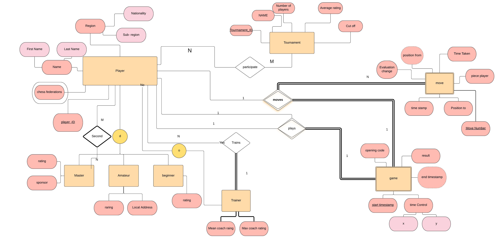
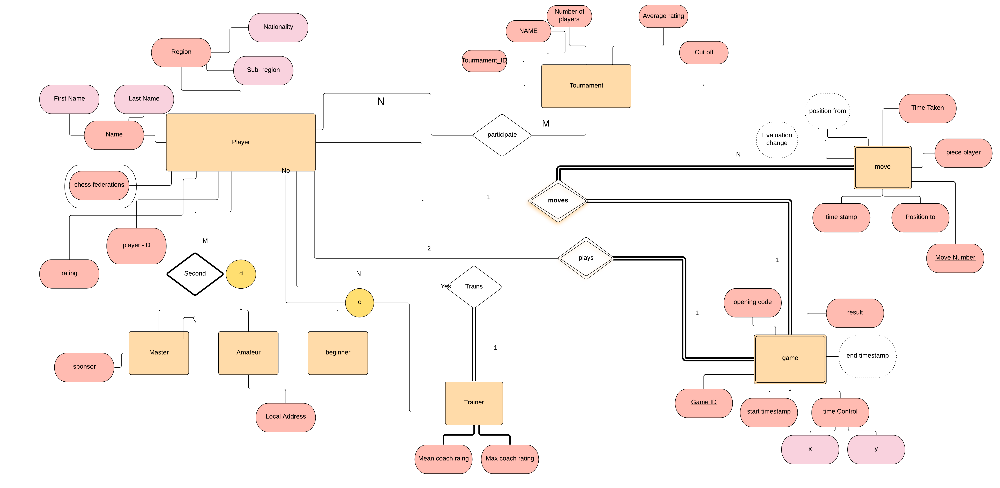

# ER Diagram

## Project Phase 2

### Team 1 - Data Analyst

ER Diagram of Requirements given as “Morphy Database" by Team of Mukund Choudhary and Animesh Sinha.

The following is the ER Diagram for the exact given requirements. This contains some mistakes that were present in the requirements document itself which will be corrected in the second document.

#### Problems with this ER Diagram:

- Game must have an ID as given by Move entity's attributes, game id is required as foreign key.

- Evaluation change must be a derived attribute as it is calculated by the engine and not given as an input explicitly.

- Relationship play is <u>NOT</u> a tertiary relationship.

- Rating should be of all players and thus attribute of Player entity and not of all the subclasses individually.

Thus, after the modification are made the new ER Diagram is:

#### Modifications made:

- Added Game id as primary key of entity Game.
- Evaluation change is now a derived attribute.
- Corrected Play relation
- Rating attribute added to player entity.