# Relational Database Model

## Project Name - Coding in Circles

## Project Phase 3

### Team 1 Data-Analyst
 * Aakash Dantre - 2018101039
 * Varun Changani - 2019121011
 * Shivaan Sehgal - 2018111026

## Changes Made
Initial ER Diagram:

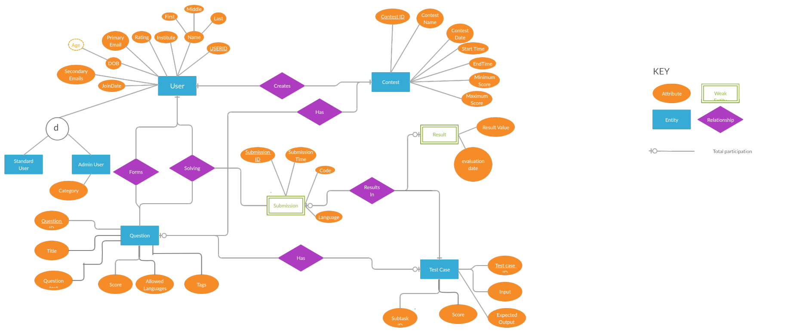

- "User" shouldn't have a "Standard User" as a subclass
- "Tags" is a multivalued attribute
- "Languages" in the relation "Question" is a multivalued attribute
- "Results In" is an identifying relationship
- "Solves" is an identifying relationship
- "Has" is an identifying relationship

Modified ER Diagram:

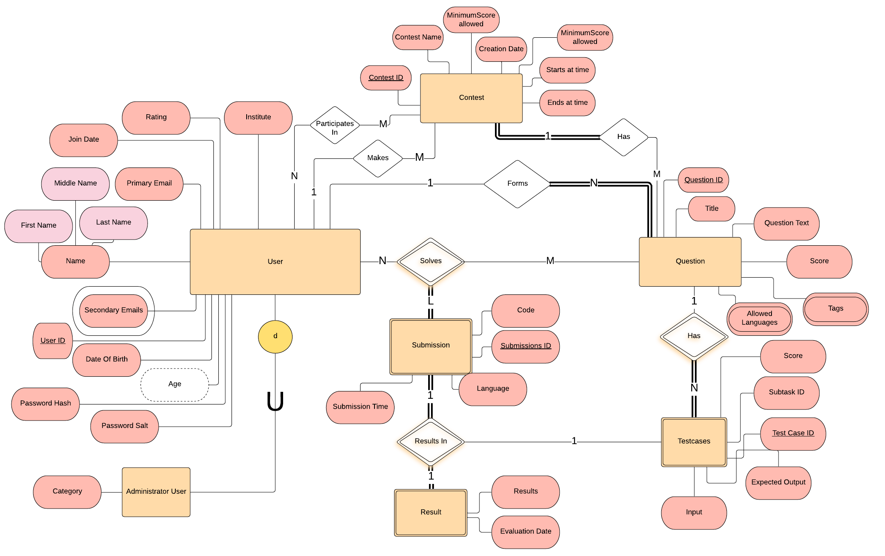

## Relational Model
The Relational Model derived from the ER Diagram is already in 3NF.
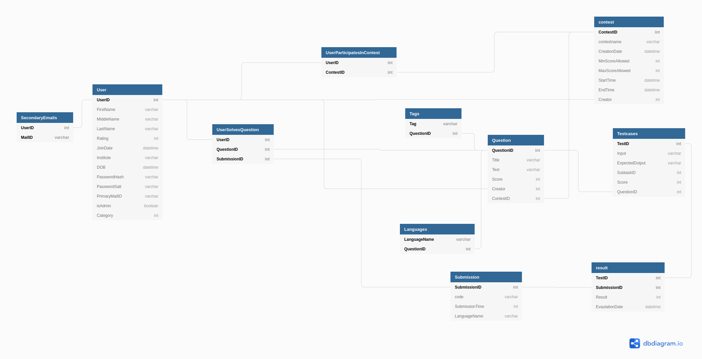

### Example Tuples for each relations:

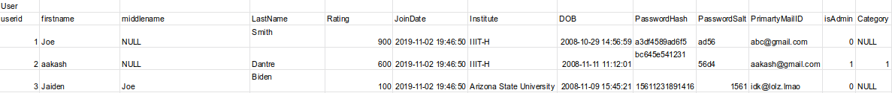

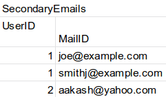

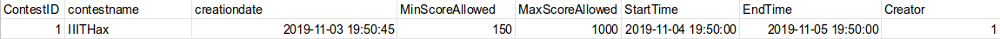

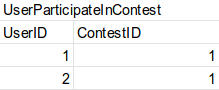

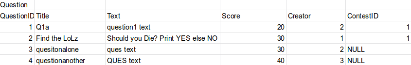

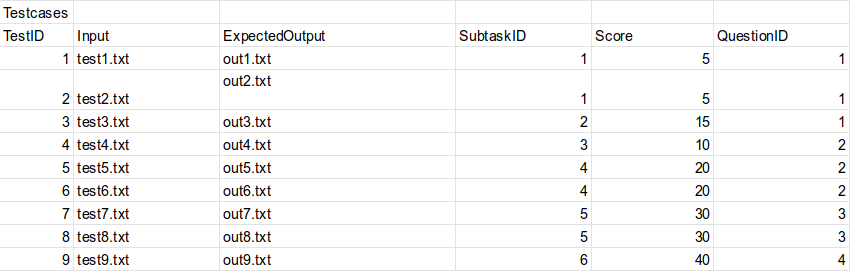

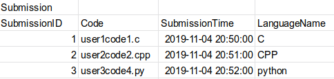

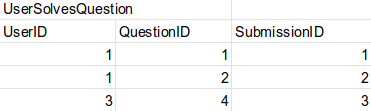

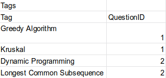

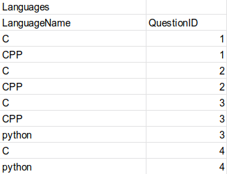

